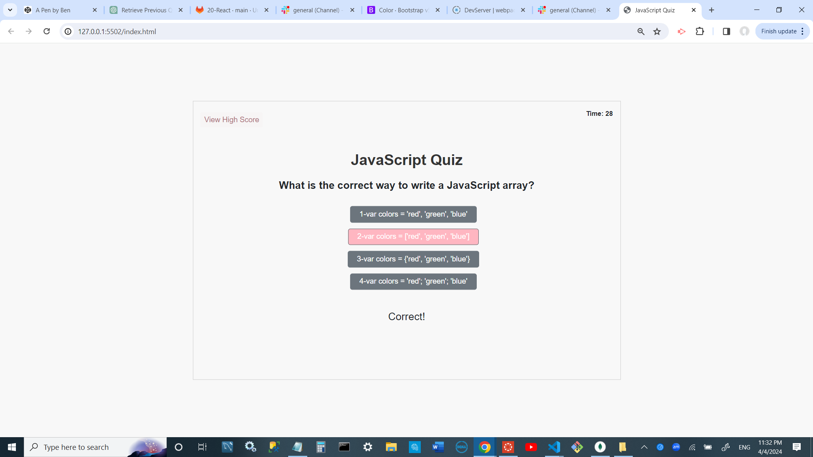

# JavaScript Interview Questions Quiz

This is a sample quiz application primarily designed for the process of interviewing candidates for JavaScript developer positions. The quiz can have many questions, and when an applicant answers a question, the application will display if the answer is correct or wrong.

## Features

- Multiple-choice questions with immediate feedback on correctness of answers.
- Applicants can take the quiz several times to improve their scores.
- Ability to display the maximum score achieved by an applicant by clicking on a designated button.

## Getting Started

To use the application, follow these steps:

1. Clone the repository: `git clone https://github.com/bahman927/challenge4.git`
2. Open the `index.html` file in your web browser.

## Usage

1. Click the "Start Quiz" button to begin the quiz.
2. Answer the questions by selecting the correct option.
3. After answering all questions, click the "Submit" button to see your score.
4. To view the maximum score achieved, click the "View Max Score" button.

## Technologies Used

- HTML
- CSS
- JavaScript
- Bootstrap
 
 
 deploy link: https://bahman927.github.io/challenge4/

